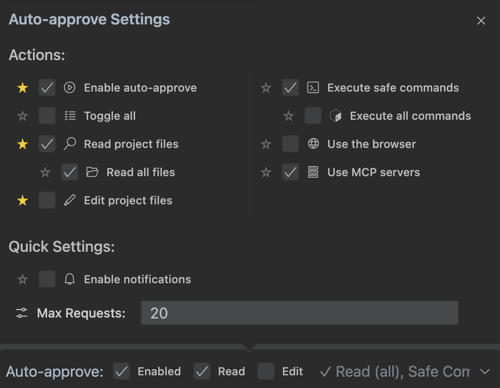

# My experiences on using tool

## Step to be friend with it

### 1. Config cline rule

- Run command `/newrule` to generate the new one [Ref.](https://docs.cline.bot/features/slash-commands/new-rule).
- [Tips](https://docs.cline.bot/features/cline-rules#tips-for-writing-effective-cline-rules)

### 2. Initialize memory bank

- Copy [Cline Custom Instruction](https://docs.cline.bot/prompting/cline-memory-bank#cline-memory-bank-custom-instructions-%5Bcopy-this%5D) follow by this prompt: **'initialize memory bank'**.
- You can update the memory-bank files from time-to-time with this prompt: **'update memory bank'**.
- You can tell cline to continue their works in memory-bank with this prompt: **'follow your custom instructions'**.

### 3. Setting cline

